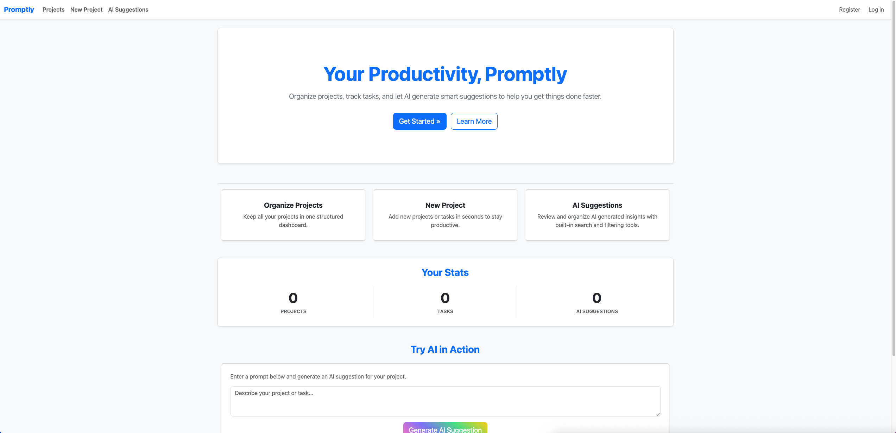
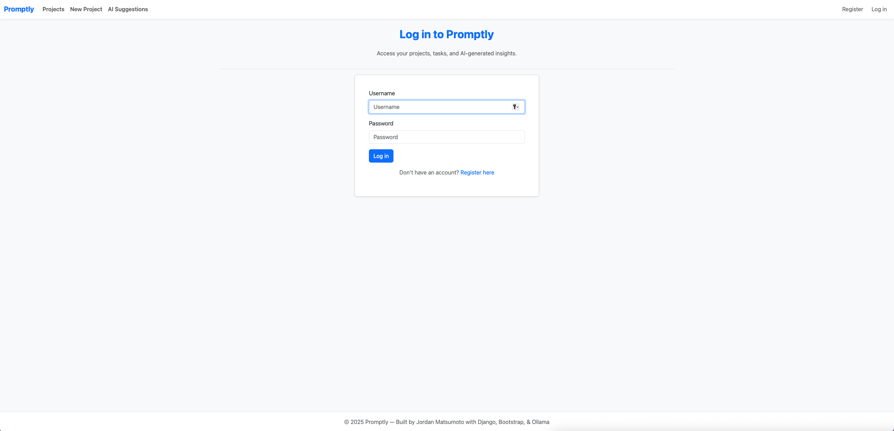
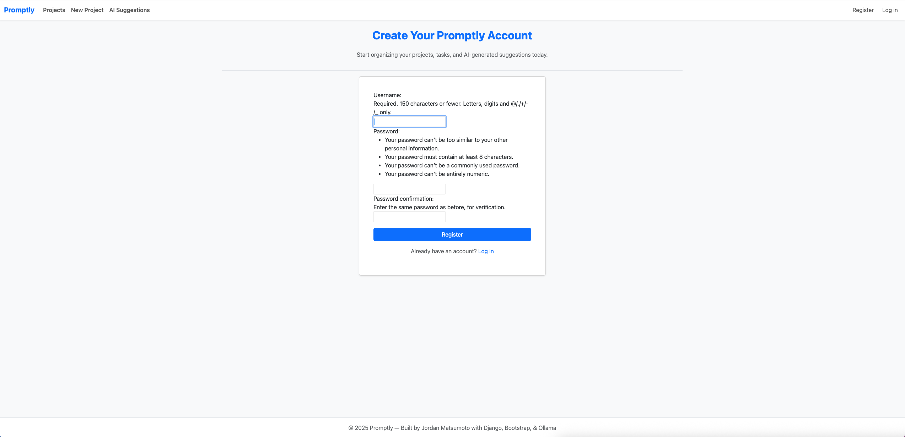
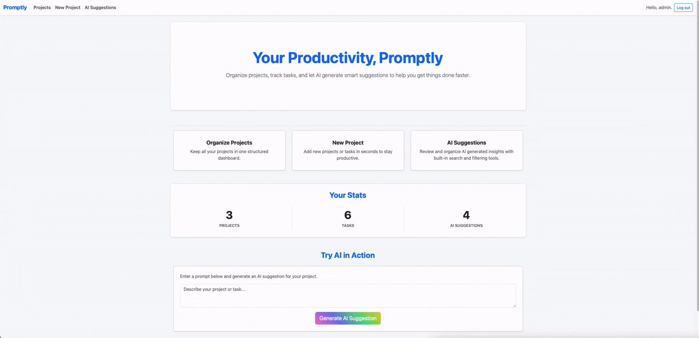
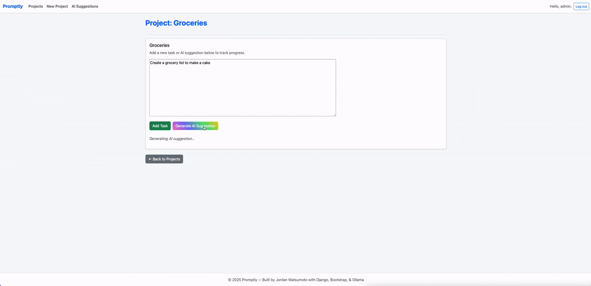
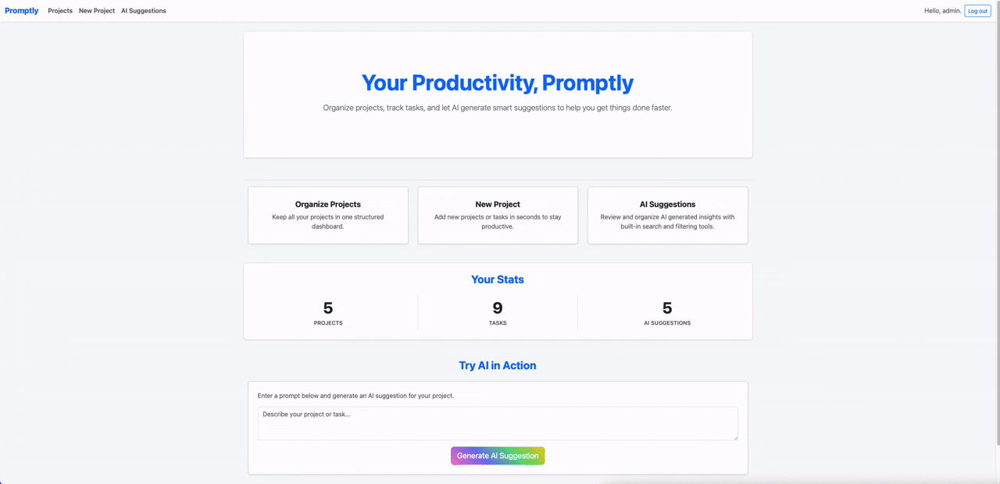

# Promptly

**Promptly** is an AI-enhanced productivity and task management web app built with **Python**, **Django**, and **Ollama’s Llama 3**. Promptly helps users organize projects, track tasks, and receive AI-generated insights to increase efficiency. This project demonstrates **task/project management**, **LLM integration**, and a clean, responsive **web interface**.

## Screenshots

### 1. Main Dashboard
  
*Overview of projects, tasks, AI suggestions, and live AI generator.*

### 2. Login
  
*Secure login to access your projects and tasks.*

### 3. Register
  
*New users can register for an account to start managing projects.*

## Demo

### 1. Create Projects and Tasks
**Prompt:**
> Create a new project and add tasks.  

**Result:**  
  
*Projects are displayed with task counts, quick links, and management buttons for editing or deletion.*

### 2. Generate AI Suggestions
**Prompt:**
> Use the “Generate AI Suggestion” button on a task or the dashboard card for quick suggestions.  

**Result:**  
  
*AI generates actionable task suggestions in real time, which can be saved directly as new tasks.*

### 3. Manage Projects and Tasks
**Prompt:** 
> Edit and delete tasks or projects.  

**Result:**  
  
*Projects and Tasks are listed with options to edit, delete, or generate AI suggestions.*

## Project Overview

- **Genre:** Productivity / Task Management AI  
- **Framework:** Django + Bootstrap 5 + Ollama Llama 3  
- **Objective:** Help users organize work efficiently with AI-assisted suggestions  
- **Visuals:** Minimal, responsive web UI with a persistent taskbar linking Main Dashboard, Projects, New Project, and AI Suggestions  
- **Features:** Project/task tracking, AI-generated task suggestions, live dashboard AI generator, filtering/searching AI suggestions  

## Features

- **Project Management:** Create, edit, and delete projects.  
- **Task Management:** Add, edit, and delete tasks linked to projects.  
- **AI Suggestions:** Generate AI suggestions for tasks or projects via Llama 3; suggestions are Markdown-formatted and can be saved as new tasks.  
- **AI History:** Track all AI-generated suggestions per project.  
- **Search and Filtering:** Filter AI suggestions by project or keyword.  
- **Dashboard AI Generator:** Live AI generation from main dashboard.  
- **Responsive UI & Taskbar:** Clean design with Bootstrap 5, gradient buttons for AI actions, and persistent navigation across pages.  
- **Authentication:** Secure user accounts with registration, login, and logout.  

## Controls

- **Add Project/Task:** Use the “+ Add” buttons or the New Project card on the dashboard.  
- **Generate AI Suggestion:** Click the gradient button on a task, project, or dashboard card to receive AI-generated recommendations.  
- **Edit/Delete:** Manage projects, tasks, and AI suggestions with inline buttons.  
- **Search AI Suggestions:** Use the search bar on the AI Suggestions page to filter results by project or keyword.  
- **Navigation:** Use the taskbar to quickly switch between the Main Dashboard, Projects, New Project, and AI Suggestions pages.  

## Installation

1. **Clone the repository**
```bash
git clone https://github.com/jordanmatsumoto/promptly.git
```

2. **Change directory**
``` bash  
cd promptly
```

3. **Create a virtual environment (optional)**
```bash
python -m venv venv
source venv/bin/activate #Linux/macOS
venv\Scripts\activate #Windows
```

4. **Install dependencies**
``` ini  
pip install -r requirements.txt
```

5. **Set up your environment variables**  
Create a .env file in the project root and add:
``` bash
DJANGO_SECRET_KEY=your_secret_key_here
DJANGO_DEBUG=True
```

6. **Apply migrations**
``` bash
python manage.py migrate
```

7. **Run the development server**
``` bash
python manage.py runserver
```

8. **Open the app in your browser**
``` cpp
http://127.0.0.1:8000/
```

## How Promptly Works

### Navigation & Taskbar
- A persistent taskbar provides quick access to:
  - **Main Dashboard:** Overview of your productivity stats and quick AI suggestions.  
  - **Projects:** View all projects and their associated tasks.  
  - **New Project:** Quickly create a new project.  
  - **AI Suggestions:** Browse all AI-generated suggestions created for your projects and tasks.  

### Project and Task Management
- Users can create projects and associate multiple tasks.  
- Tasks can optionally receive AI-generated suggestions for additional action items.  
- Each task can be edited or deleted by the project owner.  

### AI-Powered Task Suggestions
- Uses Ollama Llama 3 via `Llama_utils.py`.  
- AI suggestions are generated with a system prompt optimized for productivity and task breakdowns.  
- Suggestions are returned in Markdown format and can be directly saved as tasks.  
- Quick AI generation is available from both the dashboard and individual project pages.  

### Main Dashboard
- Displays quick stats for the logged-in user:
  - Total number of projects  
  - Total number of tasks  
  - Total AI suggestions  
- Provides a live AI generator where users can input prompts and get AI suggestions in real time.  
- Cards highlight main actions: Organize Projects, New Project, AI Suggestions.  

### Projects Page
- Lists all projects with task counts.  
- Options to view tasks, add new tasks, edit, or delete projects.  

### Project Page
- Shows tasks for a selected project.  
- Allows AI suggestions generation per task via gradient-highlighted buttons.  
- Tasks can be edited or deleted individually.  

### AI Suggestions
- A centralized page to browse, search, and filter all AI-generated suggestions.  
- Filter by project or keyword to quickly find relevant suggestions.  
- Suggestions can be edited or deleted by the owner.  

### Authentication & Security
- Users must create an account or log in to access their projects, tasks, and AI suggestions.  
- Secure authentication ensures that each user’s data is private.  
- Only the owner of a project or task can view, edit, or delete it.  

## File Structure
```
promptly/
├── assets/
│   ├── screenshots/
│   └── gifs/  
├── promptly/  
│   ├── templates/  
│   │   ├── promptly/  
│   │   │   ├── base.html  
│   │   │   ├── index.html  
│   │   │   ├── projects.html  
│   │   │   ├── project.html  
│   │   │   ├── new_project.html  
│   │   │   ├── edit_project.html  
│   │   │   ├── new_task.html  
│   │   │   ├── edit_task.html  
│   │   │   ├── ai_suggestions.html  
│   │   │   └── edit_ai_suggestion.html  
│   ├── models.py  
│   ├── views.py  
│   ├── forms.py  
│   ├── urls.py  
│   ├── admin.py  
│   └── Llama_utils.py  
├── accounts/  
│   ├── templates/  
│   │   └── registration/  
│   │       ├── login.html  
│   │       └── register.html  
│   ├── models.py  
│   ├── views.py  
│   └── urls.py  
├── promptly_project/  
│   ├── settings.py  
│   ├── urls.py  
│   ├── wsgi.py  
│   └── asgi.py  
├── manage.py  
└── requirements.txt
```